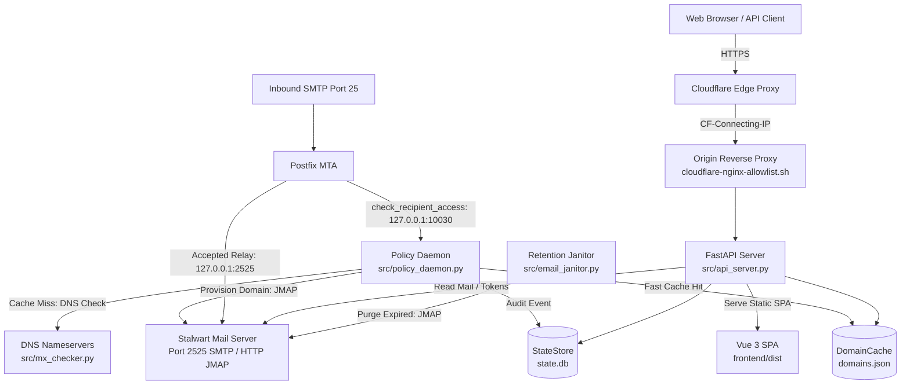

# TMail Architecture & System Invariants

This document outlines the system architecture, component boundaries, persistence separation, security invariants, and the architectural decision ledger for TMail.

For operational deployment procedures and setup instructions, see the root [README.md](../README.md). For contributor guidelines and testing, see [AGENT.md](../AGENT.md).

---

## 1. System Topology & Boundaries

TMail acts as an orchestration and access layer in front of Postfix (the Mail Transfer Agent) and Stalwart (the Mail Delivery Agent and JMAP store).

### Component Roles & Boundaries

- **Postfix Policy Daemon ([`src/policy_daemon.py`](../src/policy_daemon.py))**:
  - Listens on `127.0.0.1:10030` via TCP line protocol, registered as a recipient restriction in [`deploy/postfix_main_snippet.cf`](../deploy/postfix_main_snippet.cf).
  - Executed synchronously on incoming SMTP `RCPT TO` commands.
  - A fast cache hit against [`src/domain_cache.py:DomainCache`](../src/domain_cache.py) returns `action=OK` in microseconds.
  - A cache miss triggers an MX lookup via [`src/mx_checker.py`](../src/mx_checker.py). If the domain's MX points to `mx_hostname`, the daemon dynamically provisions the domain in Stalwart via JMAP ([`src/jmap_client.py`](../src/jmap_client.py)), updates `DomainCache`, and emits an audit event to [`src/api_state.py:StateStore`](../src/api_state.py).
- **Web & Admin API ([`src/api_server.py`](../src/api_server.py), [`src/admin_api.py`](../src/admin_api.py))**:
  - FastAPI application providing public Hydra REST endpoints ([`src/api_models.py`](../src/api_models.py)), administrator endpoints (`/admin/api/*`), static asset delivery, and SPA routing.
  - Public endpoints provide passwordless, token-based mailbox inspection.
  - The SPA catch-all route explicitly guards reserved system paths (`_SPA_RESERVED`) so mailbox local-parts cannot shadow application endpoints.
- **Retention Janitor ([`src/email_janitor.py`](../src/email_janitor.py))**:
  - Independent maintenance utility triggered by [`deploy/tmail-janitor.timer`](../deploy/tmail-janitor.timer).
  - Queries Stalwart via JMAP for messages older than `retention_days` and batches their deletion.
- **Frontend SPA ([`frontend/`](../frontend/))**:
  - Vue 3 + TypeScript single-page application governed by the *Ember on Bone* design system ([`docs/design-guidelines.md`](design-guidelines.md)).

### The Stalwart & Postfix Boundary

TMail intentionally avoids managing low-level mail transport:
- **No SMTP or Transport Ownership**: Postfix exclusively owns port 25 and network inbound relay. Stalwart exclusively owns physical message storage, indexing, and mailbox allocation.
- **No TLS or DNS Configuration**: TMail does not generate TLS certificates or modify external DNS zone files.
- **Web-Only Domain Suppression**: When an administrator blocks a domain via the admin console (`blacklisted_domains`), the domain is suppressed only from the public web UI and API. Postfix and Stalwart continue accepting and delivering email for that domain, preventing administrative disruption or dropped relay traffic.

---

## 2. Persistence Layers (Dual Store Model)

TMail partitions persistence between two independent stores with distinct performance profiles:

| Store | Underlying Mechanism | Executable Owner | Primary Purpose | Concurrency Model |
|---|---|---|---|---|
| **Domain Cache** | Atomic JSON file (`domains.json`) | [`src/domain_cache.py:DomainCache`](../src/domain_cache.py) | Instant lookup of MX-verified domains for Postfix SMTP checks | In-memory `set` synchronized via `fcntl.flock` and file generation tracking |
| **State Store** | SQLite database (`state.db`) | [`src/api_state.py:StateStore`](../src/api_state.py) | Relational storage: site settings, admin sessions, unlock keys, frozen domains, activity logs | Multi-process SQLite with `PRAGMA journal_mode=WAL` |

### Why Persistence Is Partitioned

1. **Zero Contention on the SMTP Path**: Postfix queries the policy daemon synchronously for every recipient. Storing accepted domains in SQLite would introduce lock contention and transaction overhead during inbound traffic spikes. `DomainCache` allows the daemon to serve lookups entirely from memory, refreshing only when the file generation tuple `(st_dev, st_ino, st_mtime_ns, st_size)` changes.
2. **Process Independence**: The policy daemon and API server run as decoupled OS processes. Neither process shares memory or coordinates via IPC sockets; coordination relies exclusively on POSIX atomic filesystem semantics and SQLite WAL mode.

---

## 3. Security Invariants

### Invariant 1: Untrusted Email Content Sandboxing
- **Invariant**: Arbitrary email HTML is treated as hostile and must never be rendered within the primary DOM context.
- **Enforcement**:
  - [`src/api_server.py`](../src/api_server.py) serves a stripped, isolated document shell (`_SANDBOX_DOCUMENT`) under `/message-sandbox` and `/sandbox`.
  - [`frontend/src/components/SandboxFrame.vue`](../frontend/src/components/SandboxFrame.vue) mounts the content inside an `<iframe>` restricted by `sandbox="allow-scripts allow-popups allow-popups-to-escape-sandbox"`.
  - Data transfer occurs strictly through window `postMessage` protocol after receipt of a ready signal.
  - [`frontend/vite.config.ts`](../frontend/vite.config.ts) sets `assetsInlineLimit: 0` to prohibit inlining web fonts as `data:` URIs. This preserves the strict Content Security Policy (`default-src 'self'`), which disallows inline font schemes.

### Invariant 2: Origin Firewalling under Cloudflare DNS Proxy
- **Invariant**: When deployed behind Cloudflare's DNS proxy (rather than Cloudflare Tunnel), the origin server must reject all direct non-Cloudflare HTTP connections.
- **Enforcement**:
  - [`src/api_server.py`](../src/api_server.py) trusts the incoming `CF-Connecting-IP` header unconditionally for rate-limiting client buckets (`/accounts`, `/token`, `/unlock`, `/admin/login`).
  - Because the origin server maintains a publicly reachable IP address, attackers could bypass Cloudflare and forge arbitrary `CF-Connecting-IP` headers if direct connections are permitted.
  - The origin firewall must restrict incoming HTTP/HTTPS ports to Cloudflare's published CIDR blocks using [`deploy/cloudflare-nginx-allowlist.sh`](../deploy/cloudflare-nginx-allowlist.sh) or OS firewall rules (`ufw` / `iptables`).

### Invariant 3: Stateless Public Inbox Access
- **Invariant**: Temporary mailbox authorization must not require server-side session allocation or account creation.
- **Enforcement**:
  - [`src/api_auth.py:AddressToken`](../src/api_auth.py) issues HMAC-SHA256 signed bearer tokens encoding the normalized address and authorization level, signed with `api_token_secret`.
  - Token validation is stateless and instantaneous, eliminating database queries and session cleanup overhead for millions of ephemeral visitor inboxes.

### Invariant 4: Runtime Config Immutability and Device/Inode Pinning
- **Invariant**: Code releases must be immutable, and runtime configuration mutations must be guarded against race conditions or tampering.
- **Enforcement**:
  - In production, release artifacts under `/opt/tmail-policy` are read-only.
  - Runtime configuration resides separately at `/var/lib/tmail-policy/config.json`.
  - [`src/config.py:ConfigStore`](../src/config.py) applies updates via atomic temporary files with fsync, directory fsync, and `os.replace`.
  - [`deploy/install.sh`](../deploy/install.sh) and [`deploy/release.sh`](../deploy/release.sh) execute `python3 -m src.config install-runtime` and `remove-runtime` to record and verify the physical filesystem identity `(dev, inode)`, preventing accidental overwrites or symlink manipulation during promotions and rollbacks.

### Invariant 5: Single-Process API Ownership in Hybrid Deployments
- **Invariant**: A deployment host must never run conflicting API server instances across differing supervisors.
- **Enforcement**:
  - If the Web API is deployed via Docker Compose while the policy daemon runs as a systemd service on the host, the systemd unit `tmail-api.service` must be disabled (`sudo systemctl disable --now tmail-api.service`).
  - Failure to disable the host service results in two split-brain instances reading and writing divergent `config.json` files (one at `/var/lib/tmail-policy/config.json` and one inside Docker volume `tmail-data`).

### Invariant 6: Strict Port Allocation and Reverse Proxy Boundaries
- **Invariant**: Network listeners on the host must maintain disjoint port ownership to prevent public reverse proxy hijacking and internal API collisions.
- **Enforcement**:
  - **Port 25**: Postfix MTA (exclusive public SMTP listener).
  - **Port 2525**: Stalwart internal SMTP listener (receives relays from Postfix).
  - **Port 8080**: Stalwart internal JMAP HTTP API (`http://127.0.0.1:8080/jmap/` used by [`src/jmap_client.py`](../src/jmap_client.py)).
  - **Port 8443**: Stalwart WebUI HTTPS listener (isolated from public web ports).
  - **Port 80 & 443**: Host Nginx Reverse Proxy (terminates public HTTP and Let's Encrypt TLS; configured via [`deploy/nginx-tmail.conf.example`](../deploy/nginx-tmail.conf.example)).
  - **Port 8081**: Docker `frontend` container bound to `127.0.0.1:8081` (specified in [`compose.yaml`](../compose.yaml)).
  - **Port 8000**: Docker `api` container (FastAPI backend exposed within the Docker bridge network).
  - **Port 10030**: Postfix policy daemon bound to `127.0.0.1:10030`.

### Invariant 7: Network MTU 1500 Enforcement (Preventing PMTUD Black Holes)
- **Invariant**: On cloud virtualized environments with Jumbo Frame defaults (e.g., Oracle Cloud default MTU 9000), the primary network interface must be pinned to MTU 1500.
- **Enforcement**:
  - Cloudflare Anycast edge nodes connect via standard MTU 1500 (TCP MSS 1460). When an origin interface responds with MTU 9000 (MSS 8960), transit gateways drop frames exceeding 1500 bytes. When ICMP Fragmentation Needed is blackholed, connections stall indefinitely in `SYN-RECV` or `FIN-WAIT-1`, causing Cloudflare Error 522 timeouts.
  - Origin hosts must persist MTU 1500 in `/etc/netplan/99-mtu.yaml` (`dhcp4-overrides: {use-mtu: false}`), disable cloud-init network overrides via `/etc/cloud/cloud.cfg.d/99-disable-network-config.cfg`, and configure BBR with TCP timestamps disabled (`net.ipv4.tcp_timestamps = 0`) to prevent Anycast ECMP PAWS drops.

---

## 4. Architectural Decision Ledger

| Decision | Context & Problem | Rejected Alternatives | Chosen Solution & Trade-offs |
|---|---|---|---|
| **Split Persistence Model** | Synchronous SMTP recipient validation requires sub-millisecond response latency during heavy connection floods. | Storing domains in SQLite (`state.db`) alongside site settings and activity logs. | Partitioned storage: `DomainCache` (`domains.json`) for instant in-memory sets; `StateStore` (`state.db`) for relational data. *Trade-off:* Requires managing two distinct files, but eliminates database locks on the SMTP hot path. |
| **Web-Only Domain Suppression** | Administrators need to hide retired or problematic domains from the temporary mail interface without dropping existing inbound mail. | Propagating domain bans to Postfix transport maps or rejecting them at port 25. | Suppressing blacklisted domains exclusively in the public API and UI (`blacklisted_domains`). *Trade-off:* Inbound mail continues reaching Stalwart, but existing user workflows and administrative forwards do not suffer hard bounces. |
| **Stateless HMAC Bearer Tokens** | Ephemeral inboxes generate massive churn; persisting database session rows creates unbound storage growth. | Database-backed sessions or traditional user account tables in SQLite. | HMAC-SHA256 bearer tokens ([`src/api_auth.py:AddressToken`](../src/api_auth.py)) encoding the address and authorization tier. *Trade-off:* Tokens cannot be individually revoked before expiration, but database writes on token creation drop to zero. |
| **Iframe Content Sandboxing** | Inbound emails contain arbitrary, untrusted HTML, SVG, and CSS from external senders that could exploit the web client. | HTML sanitization libraries (e.g., Bleach or DOMPurify) rendered directly into the host DOM. | Isolated sandbox `<iframe>` communicating solely through `postMessage`, combined with `assetsInlineLimit: 0` in Vite. *Trade-off:* Added asynchronous frame messaging complexity, but provides ironclad script and CSS isolation. |
| **Origin IP Allowlisting for Cloudflare** | Rate-limiting buckets trust `CF-Connecting-IP` directly to track visitor request quotas. | Relying solely on edge WAF rules without origin port firewalling. | Enforcing origin-level IP allowlisting ([`deploy/cloudflare-nginx-allowlist.sh`](../deploy/cloudflare-nginx-allowlist.sh)) for all Cloudflare proxy deployments. *Trade-off:* Requires recurring cron synchronization of Cloudflare CIDRs, but prevents IP spoofing against origin ports. |
| **Filesystem Device/Inode Config Pinning** | Deployments and rollbacks must guarantee configuration integrity without downtime or file corruption. | In-place file edits or unpinned symlink directory switching. | CLI-managed atomic installs (`src.config install-runtime`) pinning `(dev, inode)` pairs. *Trade-off:* Deployment scripts require strict error handling and cleanup, but invalid configurations or half-written files never reach production services. |
| **Stalwart Port 8443 Web Isolation & Host Nginx SSL** | Stalwart by default binds port 443, conflicting with public web reverse proxies and intercepting HTTPS traffic. | Running Nginx only on port 80 (Flexible SSL) without origin port 443 listener. | Relocating Stalwart HTTPS listener to port 8443 and terminating Let's Encrypt SSL on host Nginx ports 80/443. *Trade-off:* Requires managing SSL certificates on both Cloudflare and host Nginx, but eliminates port conflicts, 521/522 fallback timeouts, and direct connection errors. |
| **Host MTU 1500 Pinning on Cloud VPS** | Cloud hypervisors (Oracle Cloud) assign MTU 9000, creating PMTUD black holes with Cloudflare Anycast edge nodes. | Relying on TCP MSS clamping at the firewall level. | Pinned host MTU 1500 via Netplan override and disabling cloud-init network updates. *Trade-off:* Slightly lower intra-VPC throughput, but guarantees 100% reliable packet transit across public internet gateways. |
