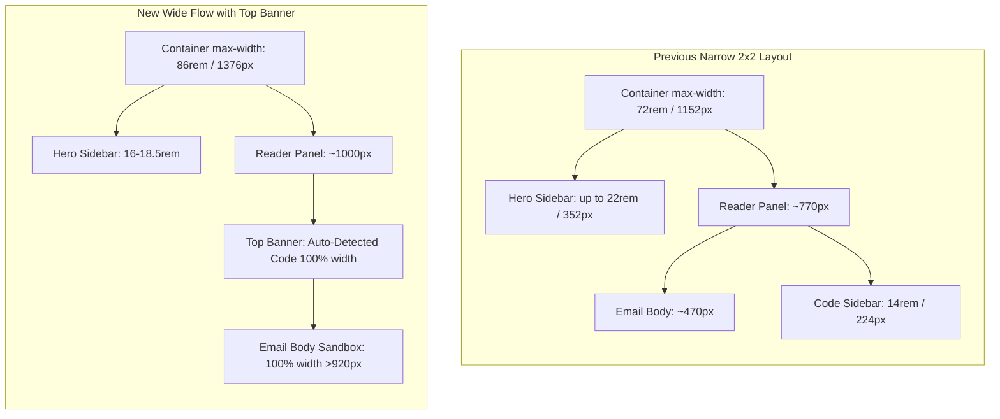

# Inbox Newest-First Sorting & Wide Reader with Top Code Banner

## Overview

The temporary mail inbox currently exhibits three usability friction points:
1. **Unspecified email list sort order**: Messages fetched from JMAP do not explicitly request sorting, leaving the order to server defaults (often oldest-first or arbitrary ID ordering). When viewing multiple emails or paginating, newer emails can end up pushed to later pages or placed awkwardly in the list.
2. **Double 2-column layout severely squeezing email reading area**: When viewing an email, `.inbox-view` is already a 2-column grid (sidebar hero card on the left taking up to 22rem + reader panel on the right). Inside `MessageReader.vue`, `.reader-content-grid` introduced a *second* 2-column layout where auto-detected verification codes occupied a dedicated 14rem (~224px) right-hand sidebar. This squeezed the actual email body (`.reader-body` / `.sandbox-frame`) down to only ~470px wide on standard desktop viewports.
3. **Constrained container max-width**: The overall page container `.page.inbox-page` was capped at `72rem` (1152px), leaving wide desktop displays mostly empty with an artificially cramped email frame.

This plan addresses all three requirements:
- Adds `"sort": [{"property": "receivedAt", "isAscending": False}]` to JMAP `Email/query` and client-side sorting in Vue, guaranteeing newest emails appear first on page 1.
- Refactors the verification code into an ergonomic, prominent full-width banner placed above the email body.
- Expands container width to `86rem` (~1376px) and tightens the sidebar, giving the email content iframe **>920px** of horizontal space (an ~95% width increase).

## Scope Challenge

- **Existing code to reuse**:
  - `JmapClient.list_messages` in `src/jmap_client.py` (add sort comparator).
  - `extractVerificationCode` in `frontend/src/verificationCode.ts` (unchanged regex logic).
  - `SandboxFrame.vue` (unchanged sandboxed iframe security architecture).
  - Design tokens in `frontend/src/styles.css` (`--primary`, `--primary-soft`, `--line`, `--font-mono`, `--radius`).
  - i18n catalogs (`t('reader.code')`, `t('address.copy')`, `t('inbox.codeCopied')` already present).
- **Minimum change**:
  - Backend: 1 file (`src/jmap_client.py`) + 1 test file (`tests/test_jmap_mail.py`).
  - Frontend: 3 files (`InboxView.vue`, `MessageReader.vue`, `styles.css`) + 2 test files (`InboxView.test.ts`, `MessageReader.test.ts`).
- **Complexity**: Low to moderate. Strictly additive/refactoring of existing presentation and query parameters. No schema or database migrations required.

## Decisions

- **Two-layer sorting (Backend JMAP query + Frontend defensive sort)**:
  - Backend JMAP RFC 8621 comparator `{"property": "receivedAt", "isAscending": False}` ensures pagination is strictly ordered from newest to oldest on the server (page 1 has the 15 latest emails).
  - Frontend `InboxView.vue` computes `pageMessages` with `sort((a, b) => new Date(b.createdAt).getTime() - new Date(a.createdAt).getTime())` to protect against client-side race conditions or mocks.
- **Top banner layout for verification code**:
  - Replaces the 14rem right sidebar with a horizontal banner directly above `.reader-body`.
  - Conforms to "Ember on Bone" design guidelines: `var(--primary-soft)` background, `1px solid var(--primary)` border, prominent monospace code, single-click copy action.
  - Releases 100% horizontal width of the reader panel to the email body (`.sandbox-frame`).
- **Expanded desktop container and optimized sidebar**:
  - `.page.inbox-page` widened from `72rem` to `86rem` (~1376px) with responsive padding.
  - `.inbox-hero` grid column tightened to `minmax(16rem, 18.5rem)` (down from `22rem`), freeing up extra width for the reader.
  - Preserves vertical sticky address hero card so users can still see their address, copy it, and monitor auto-refresh countdown without leaving the reader.

## Architecture & Layout Flow

## Phases

| Phase | Name | Status |
|---|---|---|
| 1 | [Backend: JMAP Newest-First Query Sorting](./phase-01-backend-jmap-sorting.md) | Completed |
| 2 | [Frontend: Inbox Message List Newest-First Sorting](./phase-02-frontend-newest-first-sorting.md) | Completed |
| 3 | [Frontend: Top Code Banner & Wide Reader Layout](./phase-03-top-code-banner-and-wide-reader.md) | Completed |

## Validation Strategy

- **Backend Pytest**:
  - Verify JMAP `Email/query` sends `"sort": [{"property": "receivedAt", "isAscending": False}]`.
  - All 280 existing pytest tests pass without regressions.
- **Frontend Vitest**:
  - Verify `InboxView` renders messages newest-first when given out-of-order data.
  - Verify `MessageReader` renders `.verification-code` banner at the top preceding `.reader-body`.
  - Verify copy verification code action and accessibility attributes.
  - All 192 existing vitest tests pass.
- **Visual & Layout Verification**:
  - Check desktop width allocation (>900px for sandbox frame).
  - Verify mobile responsiveness (`max-width: 640px`) remains fully functional and stacked.
