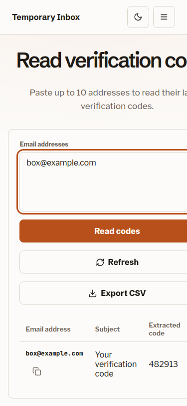
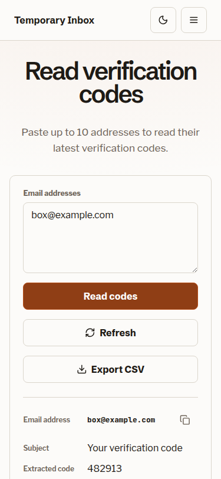

# TMail UI audit and component specification

29 September 2026 · Local Vue/Vite build · 375 × 812, 768 × 1024, 1440 × 900

## Outcome

The public flows now fit the requested viewports. The 375px bulk reader uses labeled result rows, the 768px public header retains its brand behind a menu, and a normal address stays on one line in the 1440px inbox rail. The admin dashboard also passes the focused axe check after its metric markup was corrected. The remaining work is mainly flow clarity and state continuity, described below.

### Design brief

```text
Register:  Product
Scene:     A visitor checks a short-lived address on a phone; an operator reviews mail and domains on a laptop, often in low light.
Direction: Preserve Ember on Bone because warm, quiet surfaces keep addresses, codes and operational status easy to scan.
Color:     Restrained; light bg oklch(97.5% 0.006 75), text oklch(18% 0.012 50), ember accent oklch(56% 0.15 45); paired espresso dark theme.
Type:      Schibsted Grotesk display + Libre Franklin body; JetBrains Mono for addresses, codes and timestamps. Vietnamese display uses Libre Franklin.
Signature: The address and extracted code are the two functional landmarks.
Dials:     variance 3, motion 2, density 6.
```

## Evidence and coverage

Captures show the actual Vue components. A local test API supplied example domains, one example message, and example admin values because no mail service was running. These figures are layout fixtures, not production data. The domain error and admin sign-in captures used blocked requests; loading captures used delayed responses. No send, delete, settings save, or credential action was performed.

| Screen or state | 375px | 768px | 1440px |
|---|---|---|---|
| Home, loaded | [capture](ux-audit-260929-1802-tmail/screenshots/375-home-loaded.png) | [after header fix](ux-audit-260929-1802-tmail/screenshots/768-home-fixed.png) | [capture](ux-audit-260929-1802-tmail/screenshots/1440-home-loaded.png) |
| Inbox, loaded | [capture](ux-audit-260929-1802-tmail/screenshots/375-inbox-loaded.png) | [capture](ux-audit-260929-1802-tmail/screenshots/768-inbox-loaded.png) | [after type fix](ux-audit-260929-1802-tmail/screenshots/1440-inbox-fixed.png) |
| Message reader | [capture](ux-audit-260929-1802-tmail/screenshots/375-reader-loaded.png) | [capture](ux-audit-260929-1802-tmail/screenshots/768-reader-loaded.png) | [capture](ux-audit-260929-1802-tmail/screenshots/1440-reader-loaded.png) |
| Bulk generation, empty / populated | [empty](ux-audit-260929-1802-tmail/screenshots/375-bulk-generate-empty.png) · [results](ux-audit-260929-1802-tmail/screenshots/375-bulk-generate-results.png) | [empty](ux-audit-260929-1802-tmail/screenshots/768-bulk-generate-empty.png) · [results](ux-audit-260929-1802-tmail/screenshots/768-bulk-generate-results.png) | [empty](ux-audit-260929-1802-tmail/screenshots/1440-bulk-generate-empty.png) · [results](ux-audit-260929-1802-tmail/screenshots/1440-bulk-generate-results.png) |
| Bulk code reader, empty / populated | [empty](ux-audit-260929-1802-tmail/screenshots/375-bulk-read-empty.png) · [fixed results](ux-audit-260929-1802-tmail/screenshots/375-bulk-read-results-fixed.png) | [empty](ux-audit-260929-1802-tmail/screenshots/768-bulk-read-empty.png) · [results](ux-audit-260929-1802-tmail/screenshots/768-bulk-read-results-fixed.png) | [empty](ux-audit-260929-1802-tmail/screenshots/1440-bulk-read-empty.png) · [results](ux-audit-260929-1802-tmail/screenshots/1440-bulk-read-results-fixed.png) |
| Admin sign-in | [capture](ux-audit-260929-1802-tmail/screenshots/375-admin-login.png) | [capture](ux-audit-260929-1802-tmail/screenshots/768-admin-login.png) | [capture](ux-audit-260929-1802-tmail/screenshots/1440-admin-login.png) |
| Admin dashboard | [capture](ux-audit-260929-1802-tmail/screenshots/375-admin-dashboard.png) | [capture](ux-audit-260929-1802-tmail/screenshots/768-admin-dashboard.png) | [capture](ux-audit-260929-1802-tmail/screenshots/1440-admin-dashboard.png) |
| Admin General | [capture](ux-audit-260929-1802-tmail/screenshots/375-admin-general.png) | [capture](ux-audit-260929-1802-tmail/screenshots/768-admin-general.png) | [capture](ux-audit-260929-1802-tmail/screenshots/1440-admin-general.png) |
| Admin Mail Server | [capture](ux-audit-260929-1802-tmail/screenshots/375-admin-mail.png) | [capture](ux-audit-260929-1802-tmail/screenshots/768-admin-mail.png) | [capture](ux-audit-260929-1802-tmail/screenshots/1440-admin-mail.png) |
| Admin Domains & Inbox | [capture](ux-audit-260929-1802-tmail/screenshots/375-admin-domains.png) | [capture](ux-audit-260929-1802-tmail/screenshots/768-admin-domains.png) | [capture](ux-audit-260929-1802-tmail/screenshots/1440-admin-domains.png) |
| Admin Access, empty | [capture](ux-audit-260929-1802-tmail/screenshots/375-admin-access-empty.png) | [capture](ux-audit-260929-1802-tmail/screenshots/768-admin-access-empty.png) | [capture](ux-audit-260929-1802-tmail/screenshots/1440-admin-access-empty.png) |
| Admin HTML & Ads | [capture](ux-audit-260929-1802-tmail/screenshots/375-admin-content.png) | [capture](ux-audit-260929-1802-tmail/screenshots/768-admin-content.png) | [capture](ux-audit-260929-1802-tmail/screenshots/1440-admin-content.png) |

Additional state evidence: [home loading](ux-audit-260929-1802-tmail/screenshots/375-home-loading-dark-vi.png), [home error](ux-audit-260929-1802-tmail/screenshots/375-home-error-dark-vi.png), [inbox loading](ux-audit-260929-1802-tmail/screenshots/375-inbox-loading-dark-vi.png), [admin loading](ux-audit-260929-1802-tmail/screenshots/375-admin-loading-dark-vi.png), [dark Vietnamese inbox](ux-audit-260929-1802-tmail/screenshots/375-inbox-dark-vi.png), [reader](ux-audit-260929-1802-tmail/screenshots/375-reader-dark-vi.png), [admin](ux-audit-260929-1802-tmail/screenshots/375-admin-dark-vi.png), and [bulk reader with focus](ux-audit-260929-1802-tmail/screenshots/375-bulk-read-dark-vi-focus.png). Light English was captured on every listed screen; dark Vietnamese was sampled on each main flow and at all three widths on the bulk reader. Other theme/language/width combinations remain visually unverified.

## Annotated layouts

Numbers identify the functional regions in the linked captures. These are current layouts after the fixes, except where a proposal is called out.

### Home

```text
375                    768 / 1440
┌──────────────────┐   ┌────────────────────────────┐
│ 1 brand + menu   │   │ 1 brand + menu / full nav  │
├──────────────────┤   ├────────────────────────────┤
│ 2 headline       │   │ 2 centered headline        │
│ 3 address form   │   │ 3 address form, 2 fields   │
│   fields stacked │   │   on one row               │
│ 4 saved inboxes  │   │ 4 saved inboxes            │
└──────────────────┘   └────────────────────────────┘
```

1. Brand and theme remain visible at 375 and 768; the menu holds navigation, unlock and language. 2. One outcome-led heading precedes the form. 3. Name and domain combine into the address preview; the open action is primary. 4. Saved inboxes support return visits. The mobile “Open random email” label wraps into two tight lines beside the section title; give that action its own line if this form is revised.

### Inbox and message reader

```text
375                    768 / 1440
┌──────────────────┐   ┌─────────────┬──────────────┐
│ 1 address + copy │   │ 1 address   │ 3 message    │
│ 2 tools/status   │   │ 2 tools     │   list/search │
├──────────────────┤   │   + status  │   OR reader  │
│ 3 list or reader │   │             │              │
└──────────────────┘   └─────────────┴──────────────┘
```

1. Address is selectable monospace and copy is immediate. 2. Refresh, new address, QR, sound and notifications currently form a long mobile stack. 3. Selecting a message replaces the list in place, moves focus to Back, and presents code, metadata and body. On 375px the reader starts below the tall tool panel; the next pass should condense secondary tools so message content is visible sooner.

### Bulk tools

```text
375                                  768 / 1440
┌──────────────────────────────┐     ┌──────────────────────────────┐
│ 1 task heading               │     │ 1 task heading               │
│ 2 count / address input      │     │ 2 input + action row         │
│ 3 primary action             │     │ 3 result table               │
│ 4 results: list / labeled   │     └──────────────────────────────┘
│   address-subject-code rows  │
└──────────────────────────────┘
```

The bulk generator shows copy and CSV actions above its generated list. The code reader preserves the entered addresses while each row loads or fails. At 375px the result table now displays each field with a localized label; code and copy actions remain visible without page scrolling sideways. [Before](ux-audit-260929-1802-tmail/screenshots/375-bulk-read-results.png) and [after](ux-audit-260929-1802-tmail/screenshots/375-bulk-read-results-fixed.png) show the change.

### Admin console

```text
375                       768                         1440
┌───────────────────┐      ┌─────────┬─────────────┐   ┌────────┬────────┬─────────────┐
│ 1 status/sign-out │      │ 1 rail  │ 2 tab list  │   │ 1 rail │ 2 tabs │ 3 content   │
│ 2 horizontal tabs │      │         ├─────────────┤   │        │        │             │
│ 3 active content  │      │         │ 3 content   │   │        │        │             │
└───────────────────┘      └─────────┴─────────────┘   └────────┴────────┴─────────────┘
```

1. Status and sign-out are persistent account controls. 2. Six settings sections use a vertical tab list on desktop/tablet and horizontal scrolling on mobile. 3. The active panel holds grouped forms or metrics. At 375px tabs beyond Mail Server are outside the initial visible area, with no cue that the row scrolls; this remains the clearest admin navigation issue. [Access capture](ux-audit-260929-1802-tmail/screenshots/375-admin-access-empty.png) shows an active section while its tab is off-screen.

## Findings and recommended changes

| Priority | Finding and evidence | Status / concrete change |
|---|---|
| Major | Populated bulk codes expanded the 375px page and hid the code/action. [Before](ux-audit-260929-1802-tmail/screenshots/375-bulk-read-results.png). | **Fixed.** Labeled mobile rows and contained table width; document `scrollWidth` is 375px at a 375px viewport. |
| Major | Public 768px header compressed the brand when unlock/language/navigation shared one line. [Before](ux-audit-260929-1802-tmail/screenshots/768-home-loaded.png). | **Fixed.** Menu begins at 952px; [after](ux-audit-260929-1802-tmail/screenshots/768-home-fixed.png). |
| Minor | The ordinary `box@example.com` address wrapped inside the 1440px inbox rail. [Before](ux-audit-260929-1802-tmail/screenshots/1440-inbox-loaded.png). | **Fixed.** Reduced the rail address type scale; [after](ux-audit-260929-1802-tmail/screenshots/1440-inbox-fixed.png). |
| Major | Admin dashboard metric terms were not valid definition-list groups. Axe reported two serious rule violations. | **Fixed.** Direct `dt`/`dd` groups now pass axe with 0 violations on dashboard. |
| Major | Mobile admin hides later tabs outside a horizontal scroll area with no overflow affordance. | **Open.** Show a visible trailing fade/scroll cue and bring the selected tab into view on entry, resize and keyboard change. |
| Major | Bulk screens and admin tabs are in-memory view state. Reloading a bulk view returns home; reloading an admin section returns Dashboard. | **Open.** Put public bulk views and the selected admin section in the URL so refresh, Back and shared links restore the same task. Owners: `App.vue`, `AdminApp.vue`, `route.ts`. |
| Minor | Six inbox controls stack before messages on mobile; opening a message leaves its content below the first viewport. [Reader](ux-audit-260929-1802-tmail/screenshots/375-reader-loaded.png). | **Open.** Keep Copy and Refresh visible; group QR, sound and notifications into a labeled secondary menu. Keep New address discoverable near the address. |
| Minor | Search is page-local, but the no-results state has no clear-search action. | **Open.** Echo the query, say “on this page,” and offer Clear search while preserving the current inbox page. |
| Polish | Six equal admin metrics compete for attention on desktop. | **Open.** Make Stored messages and Active domains the lead measures; group day/week values as supporting comparisons without adding decorative cards. |

| Bulk code reader at 375px, before | Bulk code reader at 375px, after |
|---|---|
|  |  |

## Component and state specification

| Component | Layout and interaction contract | Required states and feedback |
|---|---|---|
| `AppHeader` | Brand and theme always visible. Full nav above 952px; menu at or below 952px. Escape closes the menu. Locale switch updates visible labels and document language. | Default, hover, active destination, visible focus, menu open/closed, unlock busy/error, light/dark. Menu and theme controls remain at least 44px. |
| `AddressPanel` | One name, one domain, live address preview, one primary Open inbox. Saved addresses are a secondary list. Stack fields at 375px. | Domain skeleton, no domains, fetch error + Retry, empty saved list, invalid name, opening/disabled, copy success/error. Preserve typed name after failed open. |
| `InboxView` | Address/copy panel beside list at 768/1440; stacked above list at 375. Search sits in list header; reader replaces list, not the address panel. | Initial skeleton, waiting for mail, no search results, refresh busy, retained list plus inline refresh error, new-message feedback, pagination, selected message, keyboard focus return. |
| `MessageReader` | Back, sender/subject/time, source/delete actions, extracted code, recipients, attachments, text/HTML body. Keep unsafe HTML in sandbox. | Loading skeleton, missing/stale message, fetch error + Retry, no readable body, download busy/error, seen-save error, delete confirm/busy/error, focus on Back when opened and list heading when closed. |
| `BulkGenerateView` | Count 1–10; generated addresses with per-row copy/open, Copy all and CSV. Results remain in a single list at all widths. | Domain loading/error/empty, no generated batch, populated batch, partial uniqueness notice, copy success/error. |
| `BulkCodeView` | Up to 10 unique pasted addresses; one primary Read codes. Desktop/tablet results remain a table; 375px results use localized field labels and stacked rows. | Empty input/result, row loading, ready code, no code, row error + Retry, manual/background refresh, partial input notice, CSV, copy success/error. Keep input and prior result visible during refresh. |
| `AdminApp` | Sign-in when no valid session. Dashboard, General, Mail Server, Domains & Inbox, Access, HTML & Ads in one tab set. Desktop has rail/sidebar/content; mobile stacks rail, scrollable tabs and content. | Session check, login pending/error, logout pending/error, active tab, form dirty/busy/success/error, dashboard loading/empty/error. Arrow/Home/End navigation and visible focus must work in tab list. |
| Shared primitives | Existing warm surface, hairlines, 6/8/10px radii, ember focus/action, mono technical data; default envelope favicon. | Hover, focus-visible, active, disabled, loading, empty, error and success where applicable. Body text contrast ≥4.5:1; UI/large text ≥3:1; reduced-motion setting removes transitions. |

## Journeys and verification

| Journey | Current path and friction | Smoother target |
|---|---|---|
| Open an address | Home → enter name/domain → Open inbox → copy address. Clear and short; a network error retains the input. | Keep this flow. On mobile, put random address below the form heading rather than squeezing both labels side by side. |
| Read a code | Inbox → message row → reader/code → Back. The mobile tool stack delays the message body. | Keep address/copy and refresh visible; move less common toggles into a secondary menu. |
| Bulk read | Bulk read → paste → Read codes → copy or export. The result previously overflowed at 375px. | Labeled rows now keep the result usable. URL state should restore this task after reload; avoid putting pasted addresses in a shareable URL. |
| Change admin settings | Sign in → select tab → edit/save. Mobile later tabs need horizontal discovery and refresh returns to Dashboard. | Expose the scroll cue and use a URL fragment/query for selected tab. Preserve unsaved fields on save failure. |

Verification: focused Vitest suites passed (18 tests); `vue-tsc` and Vite build passed. The first `render-check` run could not auto-discover Chrome; rerunning with the installed Chrome path found **0 errors** at 375, 768 and 1440px after the favicon and skip-link fixes. Its six remaining warnings concern intentionally clipped `.sr-only` text used for screen readers. Axe reported **0 dashboard violations**; the mobile bulk reader reported **0 violations** and one incomplete color-contrast check on the gradient-backed heading/paragraph, requiring manual contrast review. Visual rubric after fixes: brief 2, hierarchy 1, spacing 2, alignment 2, typography 2, color 2, depth 2, states 1, responsiveness 2, slop 2, copy 1, craft 1: **20/24**. Items below 2 correspond to the open findings above.

## Boundaries

The fixture did not exercise a real mail server, long translated admin values, browser notification permission prompts, attachment downloads, or destructive admin operations. Their component behavior was reviewed from source and tests; those runtime states remain unverified against a live service.
